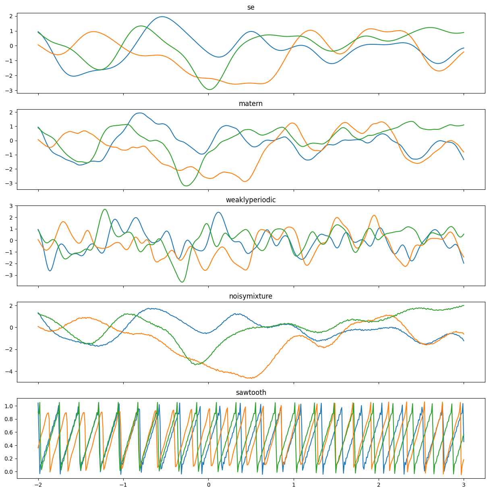
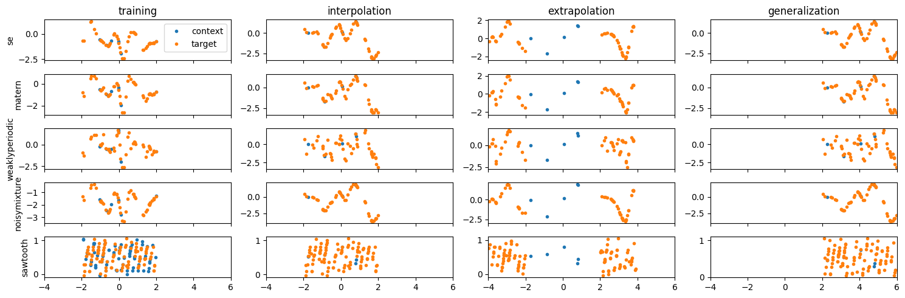

# One-dimensional regression ablation study

Experiments builds on Convolutional Neural Processes ([Fong et al., 2020](https://arxiv.org/pdf/2007.01332.pdf)) and Gaussian NPs ([Wessel et al., 2021](https://arxiv.org/pdf/2101.03606.pdf)). Their **Julia** code can be found on [github](https://github.com/wesselb/NeuralProcesses.jl/blob/master/train.jl).

|                | Fong et al. (2020) | Wessel et al. (2021) |
|----------------|--------------------|----------------------|
| noise variance | 1e-8               | 0.05^2               |
| datasets       |                    | Adds Mixture dataset |

## Data sources

|                        | Squared Exponential | Matern 52    | Weakly Periodic                 | Sawtooth      | Mixture                       |
|------------------------|---------------------|--------------|---------------------------------|---------------|-------------------------------|
| lengthscale            | 0.25                | 0.25         | SE (l = 0.5) * PerEQ (l = 0.25) |               | equal-weighted combination of others |
| num context training   | {0, ..., 50}        | {0, ..., 50} | {0, ..., 50}                    | {0, ..., 100} | {0, ..., 100}                 |
| num target training    | {50}                | {50}         | {50}                            | {100}         | {100}                         |
| num context evaluation | {0, ..., 10}                | {0, ..., 10}            | {0, ..., 10}                               | {0, ..., 10}             | {0, ..., 10}                             |
| num target evaluation  | {50}                | {50}         | {50}                            | {100}         | {100}                         |

- tasks_per_epoch = $2^{14}$
- how many epochs = 20

## Tasks

1) interpolation

 - x_context=Uniform(-2, 2)
 - x_target=Uniform(-2, 2)

 !! Equals training regime

2) extrapolation beyond context 

 - x_context=Uniform(-2, 2)
 - x_target=Uniform(-4, -2) U Uniform(2, 4)

3) generalisation

 - x_context=Uniform(2, 6)
 - x_target=Uniform(2, 6)

### Datasets

### Tasks

## Metrics

Some of the likelihoods reported in Fong et al., and Wessel et al. are lower bounds or sampled estimates. 

- Likelihoods for interpolation inside the training range

## Ablations Neural Diffusion Processes

- With and without translation invariance
- Different limiting processes: White noise, Squarand Exponentia, Periodic?

## TODO:
- [] masking

## References

- Fong et al., Meta-Learning Stationary Stochastic Process Prediction with Convolutional Neural Processes, 2020.

- Wessel et al., The Gaussian Neural Process, 2021
